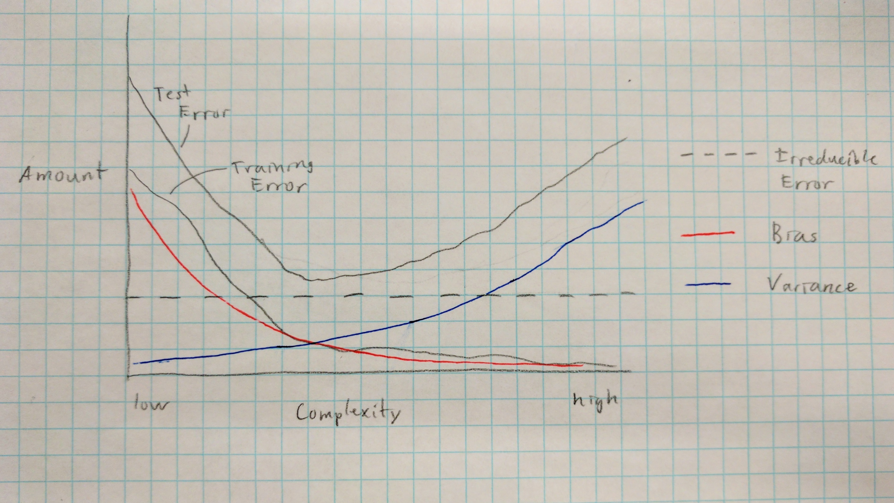

# Topic 1 Exercises
## Ilse Dippenaar

### 2.4.1

#### a) 
A flexible model would perform better in this situation since the higher flexibility can minimize the bias by capturing the effect of all the predictors while also not suffering from high variance due to the number of observations.

#### b)
An inflexible model would be superior in this case since there is a great risk for overfitting with fewer data points. 

#### c)
A more flexible model would be better here since more flexibility can capture non-linear relationships more accurately.

#### d)
Less flexibile models would be less prone to overfitting the data given the high irreducible error (inflexible models would not mistake random noise for actual relationships).

### 2.4.3
#### a)


#### b)
The irreducible error stays constant since it is inherent to the system being measured. The bias curve decreases since the model can assume less as its complexity increases, while the variance increases with model complexity since small changes in the data can create large changes in the model response. The training error decreases monotonically as model complexity increases. Higher complexity provides a super set of available options for the model, and eventually the model can completely overfit the training data until there is no training error remaining. However, the test error does not decrease monotonically and its expected value can never be less than the irreducible error. As the model begins to overfit the data, the testing error will increase.

### 2.4.6

A parametric regression approach reduces relationships between predictors and response variables to a set of parameters (i.e. coefficients), while a non-parametric approach allows for a greater fit to the data by relaxing any assumption about the form of $f$. However, the higher flexibility requires much more data to provide accurate predictions than the less flexible parametric methods.

### 2.4.8

#### a-b)
```{r, message=FALSE}
library(mosaic)
library(ISLR)
# The College dataset in ISLR already has row names set
```

#### c)

```{r, warning=FALSE}
summary(College)
pairs(College[,1:10], pch=20)
with(College, plot(Private, Outstate))
Elite <- rep("No",nrow(College))
Elite[College$Top10perc >50]="Yes"
Elite <- as.factor(Elite)
College=data.frame(College ,Elite)
summary(College$Elite)
with(College, plot(Elite, Outstate))
par(mfrow = c(2,2))
hist(College$Accept)
hist(College$Enroll)
hist(College$Room.Board)
hist(College$Grad.Rate)
with(College, t.test(Room.Board~Private))
with(College, sd(Room.Board~Private))
with(College, t.test(Top10perc~Private))
```

There is a significant difference in cost and in percentage of new students from the top 10% of high school between private and public colleges. Even though the difference in means is significant, there is still high amounts of variability in the cost of college, especially for private colleges.

### 2.4.9
#### a)
All the columns in `Auto` are quantitiave except `cyliners`, which is qualitative. The `name` column constitutes neither quantitative or qualitative observations.

#### b)
```{r}
Auto.quant_names <- names(Auto)[!names(Auto) %in% c("cylinders", "name")]
vapply(Auto.quant_names, 
       function(name) range(Auto[[name]]), 
       numeric(2))
```
#### c)
```{r}
temp <- vapply(Auto.quant_names, 
       function(name) c(mean(Auto[[name]]), sd(Auto[[name]])), 
       numeric(2))
rownames(temp) <- c("mean", "sd")
temp
```
#### d)
```{r}
Auto.mod <- Auto[-(10:85)]
temp <- vapply(Auto.quant_names, 
       function(name) c(range(Auto.mod[[name]]), 
                        mean(Auto.mod[[name]]), 
                        sd(Auto.mod[[name]])), 
       numeric(4))
rownames(temp) <- c("low", "high", "mean", "sd")
temp
```
#### e)
```{r}
with(Auto, plot(horsepower, mpg, pch=20))
with(Auto, plot(year, horsepower, pch=20))
with(Auto, plot(year, mpg, pch=20))
```

#### f)
```{r}
summary(with(Auto, lm(mpg~year)))
summary(with(Auto, lm(horsepower~year)))
```
There is a strong correlation between increased horsepower and decreased mpg, and there is a small association between increasing mpg over the course of a few years. However, horsepower does not appear to decrease much across the time scale avaiable. 

### 2.4.2
#### a)
This is an inferential regression problem. $n=500$ and $p=3$.

#### b)
This ia a predictive classification problem. $n=20$ and $p=13$.

#### c)
This is a predictive regression problem. $n=52$ and $p=3$.

### 2.4.7
#### a)
```{r}
A <- rbind(c(0,2,0,0,-1,1), c(3,0,1,1,0,1), c(0,0,3,2,1,1))
colnames(A) <- c("red", "red", "red", "green", "green", "red")
sort(apply(A, 2, function(v) sqrt(sum(v^2))))
```
#### b)
The prediction will be green since the closest point is green.

#### c)
The prediction will be red since 2 of the 3 closest points are red.

#### d)
We would expect $K$ to be small since smaller $K$ allows KNN to be more flexible, and thus create a more non-linear Bayes decision boundary.
