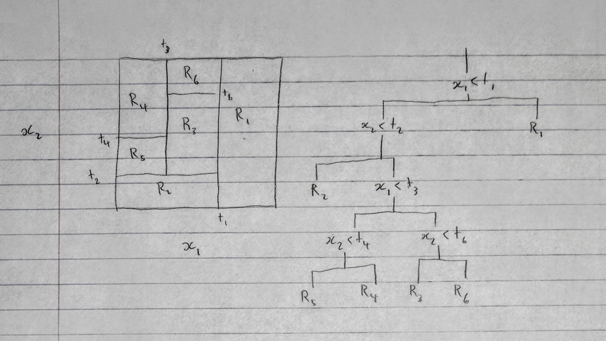
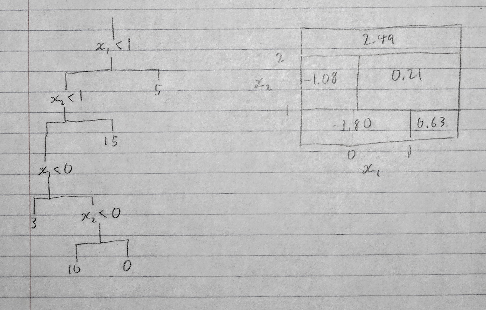

# Topic 8 Exercises: Tree-based models

### 1



### 2

Each iteration of the boosting algorithm only adds one variable, so the function $f(X)$ cannot include any trees with interaction terms, hence an additive model.

### 3
```{r}
library(ggplot2)
n <- 1000
pp <- seq(1e-10, 1, length.out = n)
d <- data.frame(pm = rep(pp, 3), 
                error = c(1-pp, pp*(1-pp), -pp*log(pp)),
                type=c(rep("Classification", n), rep("Gini", n), rep("Cross-Entropy", n)))

ggplot(d, aes(pm, error, col=type)) + geom_line() + theme_bw()
```

### 4


### 5
```{r}
probs <- c(0.1, 0.15, 0.2, 0.2, 0.55, 0.6, 0.6, 0.65, 0.7, 0.75)
sum(probs>0.5)/length(probs)
mean(probs)
```

The majority vote method would classify $X$ as red and the average probability model would classify it as green.

### 12
boosting, bagging, and random forests
```{r, message=F}
library(ISLR)
library(randomForest)
library(gbm)

d <- College
n <- nrow(d)
d["Private_num"] <- as.numeric(d$Private == "Yes")
form <- Private ~ Apps+Accept+Enroll+Top10perc+Top25perc+F.Undergrad+P.Undergrad+
  Outstate+Room.Board+Books+Personal+PhD+Terminal+S.F.Ratio+perc.alumni+Expend+Grad.Rate
form2 <- Private_num ~ Apps+Accept+Enroll+Top10perc+Top25perc+F.Undergrad+P.Undergrad+
  Outstate+Room.Board+Books+Personal+PhD+Terminal+S.F.Ratio+perc.alumni+Expend+Grad.Rate  
train_idxs <- sample(1:n, 0.75*n)
train <- d[train_idxs,]
test <- d[-train_idxs,]
mse <- function(a, b) mean((a != b)^2)
```

#### Bagging
```{r}
rf_mod_bag <- randomForest(form, train, mtry = length(names(College))-1, importance =TRUE)
mse(predict(rf_mod_bag, test), test$Private)
```

#### Boosting
```{r}
rf_mod_boost <- gbm(form2, train, distribution = "bernoulli", 
                    n.trees = 5000, interaction.depth = 4, shrinkage = 0.001)
mse(predict(rf_mod_boost, test, n.trees = 5000, type = "response")>0.5, test$Private_num)
```

#### Logistic
```{r}
mod_glm <- glm(form2, train, family = "binomial")
mse(predict(mod_glm, test, type="response")>0.5, test$Private_num)
```

The logistic model performs about equally to the others from my testing.
